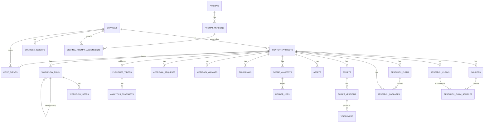

# Database Architecture

Status: **implemented (Step 3), extended through Step 13.** PostgreSQL
domain schema, real migrations, role separation, and channel isolation
are live and tested. Step 4 added the workflow-runtime SQL layer, Step 5
added topic intake, Step 6 added versioned research plans/packages, Step
7 added script grounding/QC/versioning, Step 8 added voiceover
versioning/chunk-identity/QC, Step 9 added visual shot-list/asset
versioning and licensing, Step 10 added scene-manifest versioning/
idempotency and render-job QC, Step 11 added the versioned
publication-package entity, thumbnail concepts, and title/thumbnail
pair scoring, Step 12 added resumable-upload/OAuth/scheduling state, and
Step 13 added checkpointed analytics collection, performance
benchmarking, the strategy insight lifecycle, and the platform's first
real `audit_logs` writers — see
[research-pipeline.md](research-pipeline.md),
[script-pipeline.md](script-pipeline.md),
[voiceover-pipeline.md](voiceover-pipeline.md),
[visual-asset-pipeline.md](visual-asset-pipeline.md),
[video-render-pipeline.md](video-render-pipeline.md),
[publication-package-pipeline.md](publication-package-pipeline.md),
[youtube-publication-pipeline.md](youtube-publication-pipeline.md), and
[analytics-strategy-pipeline.md](analytics-strategy-pipeline.md) for the
workflows that consume the additions described below.

## Migration system

**Chosen: [dbmate](https://github.com/amacneil/dbmate)**, pinned to
`amacneil/dbmate:2.34.1` (digest-pinned in `docker-compose.yml`, confirmed
multi-arch `linux/amd64`/`linux/arm64` via live registry query — see
[arm64-compatibility.md](arm64-compatibility.md#migration-tooling)).

Why, over the alternatives actually considered:

- **Flyway** — JVM-based; pulling in a JVM runtime for a migration tool in
  an otherwise JVM-free stack is exactly the kind of unjustified
  complexity this project avoids.
- **node-pg-migrate** — reasonable, but it's a JS DSL wrapping SQL, which
  is one more thing to learn on top of SQL itself for no real benefit
  here — this project doesn't need JS-level migration logic (conditional
  schema changes, cross-DB abstraction), just SQL.
- **Plain numbered SQL + a hand-rolled runner** — dbmate basically *is*
  this, already built, already tested by a wide user base, with a ledger
  table, `up`/`down`/`status`/`new` commands, and a single static-binary
  Docker image — writing and maintaining an equivalent runner ourselves
  would be pure yak-shaving.

dbmate migrations are plain `.sql` files with `-- migrate:up` /
`-- migrate:down` sections, tracked in a `schema_migrations` ledger table
it creates and manages itself. It:

- applies each migration exactly once (ledger-tracked, safe to re-run —
  verified: `scripts/db-migrate.sh` run twice in a row applies 0 the
  second time, see validation results in the Step 3 completion report),
- fails loudly and stops on the first error (no partial-success ambiguity
  — each migration file also runs inside its own transaction),
- works identically in dev and prod (same tool, same migrations, only
  `DATABASE_URL` changes),
- supports rollback (`dbmate down`) via the `-- migrate:down` section
  every migration in this repo includes,
- is invoked via `docker compose run --rm migrate <cmd>` — see
  `scripts/db-migrate.sh` / `db-migration-status.sh` — never baked into
  the normal `docker compose up` path (`profiles: ["tools"]`).

### Why `docker-entrypoint-initdb.d` was replaced

Step 2 used PostgreSQL's `docker-entrypoint-initdb.d` mechanism to create
an infrastructure-only healthcheck table. That mechanism only runs once,
against an empty data volume — it cannot apply a change to an existing
database, has no ledger, and offers no way to tell what's been applied.
It's fine for what it's still used for (see below) and wrong for an
evolving domain schema. `database/migrations/` (dbmate) replaced it for
all schema changes; `database/bootstrap/` (still
`docker-entrypoint-initdb.d`) is now scoped to cluster bootstrap only —
creating roles and databases, a one-time concern that doesn't need a
ledger. See `database/bootstrap/README.md`.

## Role/permission model

```text
postgres superuser (POSTGRES_USER)
  used only by database/bootstrap/ to create the roles below.
  Never used for migrations or application traffic again after that.
       │
       ├── migrator          owns the app database + public schema.
       │                     Applies schema migrations (DDL). Not used
       │                     by any running service — only scripts/db-migrate.sh.
       │
       ├── app_runtime       used by approval-api / renderer at runtime.
       │                     DML only (SELECT/INSERT/UPDATE/DELETE) via
       │                     ALTER DEFAULT PRIVILEGES set once at
       │                     bootstrap — cannot CREATE/ALTER/DROP.
       │                     (Verified: database/tests/run.js test #5.)
       │
       ├── app_readonly      reserved for future read-only/reporting use
       │                     (e.g. analytics dashboards). SELECT only.
       │                     Not wired into any service yet.
       │
       └── n8n_app           owns the separate `n8n` database outright —
                              n8n manages its own internal schema/
                              migrations itself; this role never touches
                              the application database.
```

Every table `migrator` creates automatically grants the right privileges
to `app_runtime`/`app_readonly` — no per-migration `GRANT` statement is
needed for the common case, because `database/bootstrap/` sets
`ALTER DEFAULT PRIVILEGES FOR ROLE migrator IN SCHEMA public GRANT ...`
once, at cluster bootstrap.
`database/migrations/20260722190015_grants.sql` adds an explicit
belt-and-suspenders grant on top, self-healing if that default-privilege
setup were ever missing.

Credentials for every role come from environment variables
(`MIGRATOR_DB_USER`/`_PASSWORD`, `APP_DB_USER`/`_PASSWORD`,
`APP_READONLY_DB_USER`/`_PASSWORD`, `N8N_DB_USER`/`_PASSWORD` — see
`.env.example`), never hardcoded — checked by
`scripts/security-check.sh`.

## Database boundary

Two databases on one Postgres instance:

- **`n8n`** — n8n's own internal schema, owned and migrated by n8n
  itself via `n8n_app`.
- **`$POSTGRES_DB`** (`ai_youtube_automation`) — the application domain
  schema described below, owned by `migrator`.

n8n internal tables never mix into the application schema and vice versa
— enforced by role ownership and by `app_runtime`/`migrator` having zero
grants on the `n8n` database.

## UUID strategy

Every persistent domain ID is a UUID, generated with
`gen_random_uuid()` — built into PostgreSQL core since v13 (no
`pgcrypto`/`uuid-ossp` extension needed; confirmed on 16.9). No sequential
IDs are used for anything externally referenced. Consistent everywhere:
`id UUID PRIMARY KEY DEFAULT gen_random_uuid()`.

The only contrib extension enabled anywhere in this schema is
[`pg_trgm`](https://www.postgresql.org/docs/current/pgtrgm.html) (Step 5,
`20260722210000_topic_intake_schema.sql`) — deterministic, character-
trigram topic similarity for duplicate detection, explicitly not
pgvector/embeddings. Standard PostgreSQL contrib, bundled in the official
Docker image on both `linux/amd64` and `linux/arm64` — confirmed via
`pg_available_extensions` before use, so it needed no separate ARM64
validation. See
[topic-intake.md#duplicate-and-similarity-detection](topic-intake.md#duplicate-and-similarity-detection).

## Schema overview (ER diagram)

Core entities and their primary relationships — config/lookup tables
(the nine `channel_*` settings tables, `asset_licenses`,
`voiceover_chunks`, `errors`, `dead_letter_jobs`, `audit_logs`) are
omitted from the diagram for readability and listed in the table below
instead.



### Full table list

| Domain | Tables |
|---|---|
| Channel | `channels`, `channel_settings`, `channel_branding`, `channel_content_pillars`, `channel_topic_rules`, `channel_provider_settings`, `channel_budget_limits`, `channel_publish_schedules`, `channel_strategy_profiles`, `channel_credentials` |
| Content lifecycle | `content_projects`, `topic_candidates`, `approved_topics`, `rejected_topics`, `content_briefs` |
| Research | `sources`, `research_claims`, `research_claim_sources`, `research_plans`, `research_packages` |
| Scripts | `scripts`, `script_versions` |
| Media production | `voiceovers`, `voiceover_chunks`, `assets`, `asset_licenses`, `scene_manifests`, `render_jobs`, `thumbnails`, `metadata_variants` |
| Approval & publication | `approval_requests`, `published_videos` |
| Analytics | `analytics_snapshots`, `strategy_insights` |
| Workflow execution | `workflow_runs`, `workflow_steps`, `errors`, `dead_letter_jobs` |
| Prompts | `prompts`, `prompt_versions`, `channel_prompt_assignments` |
| Cost/accounting | `cost_events`, `provider_usage_events` |
| Auditing | `audit_logs` |
| Infrastructure (not domain) | `_infra.healthcheck` |

45 tables total (43 from Step 3 + `research_plans`/`research_packages`
added in Step 6; neither Step 7 nor Step 8 added new tables —
`scripts`/`script_versions` (Step 7) and `voiceovers`/`voiceover_chunks`
(Step 8) all already existed from Step 3 and only gained columns). See
the migration files in `database/migrations/` for exact columns — each
is commented with the reasoning behind non-obvious choices.

### Step 6 additions: `research_plans` and `research_packages`

Both are **versioned** the same way scripts already were in Step 3
(`UNIQUE (content_project_id, revision)`, monotonically increasing,
never updated in place — a revision is always a new row). Neither embeds
claim or source data as JSONB copies: `research_packages.synthesis`
holds only narrative/synthesis text, while the claim and source lists
themselves are assembled live from `research_claims`/`sources` at read
time (`get_current_research_package()` in
`20260722220001_research_pipeline_functions.sql`) so there is exactly
one source of truth and no risk of a cached copy drifting from the
relational data.

- `research_plans` — one row per planning attempt/revision. LLM-generated
  (`plan` JSONB, `provider`/`model` recorded), but a plan only identifies
  *what to look for* — it is never trusted to assert facts.
- `research_packages` — one row per synthesis attempt/revision.
  `revision_trigger` (`initial` / `qc_auto_retry` / `human_revision_request`)
  and `revision_reason` record *why* a new revision exists.
  `qc_score`/`qc_status`/`qc_details` hold the deterministic QC result
  (see [research-pipeline.md#quality-control](research-pipeline.md)).
  Exactly one `is_current = true` row per `content_project_id` is
  enforced by a partial unique index
  (`idx_research_packages_one_current_per_project`), not just application
  discipline.

Also from the same migration (`20260722220000_research_pipeline_schema.sql`):

- `sources.source_type` redefined to a source-authority-relevant enum
  (`primary_source`, `government`, `academic`, `official_company`,
  `industry_report`, `reputable_news`, `expert_analysis`,
  `documentation`, `forum_community`, `social_media`, `unknown`) —
  replacing Step 3's generic media-type enum, since Step 5 never
  populated any `sources` rows (clean redefinition, not a data
  migration).
- `sources.relevance_score` (`NUMERIC(5,2)`, 0–100) added alongside the
  existing `authority_score` — deliberately separate scores, both
  deterministic (SQL-computed, never LLM-assigned) — see
  [research-pipeline.md#source-authority--relevance](research-pipeline.md).
- `channel_budget_limits.limit_type` gains `research_stage`, reusing the
  existing hard/soft + warning-threshold budget machinery rather than a
  parallel budgeting subsystem.

### Step 7 additions: `script_versions` columns, `cta_type`, `script_stage`

No new tables — `scripts` (one row per `content_project_id`,
`current_script_version_id` pointer) and `script_versions` (append-only,
`UNIQUE (script_id, version_number)`) already existed from Step 3 and
needed only additive columns:

- `script_versions.research_package_id` (FK to `research_packages(id,
  channel_id)`) — which research revision this version was grounded
  against, since the research package can gain newer revisions after a
  script version is written.
- `script_versions.estimated_duration_seconds` — the deterministic
  (word-count-based) runtime estimate computed by
  `script_deterministic_qc()`, distinct from the LLM's own estimate
  stored inside `content` — see
  [script-pipeline.md#runtime-estimation](script-pipeline.md#runtime-estimation).
- `script_versions.provider_request_id` — the Anthropic response id for
  this specific version, for debugging without a `cost_events` join.
- `script_versions.revision_trigger` (`initial_generation` /
  `automatic_qc_revision` / `human_revision_request` / `format_repair`)
  — mirrors `research_packages.revision_trigger`, kept separate from the
  pre-existing free-text `revision_reason` (human instructions or LLM
  feedback).

Also from `20260722230000_script_pipeline_schema.sql` /
`20260722230002_channel_settings_cta_type.sql`:

- `channel_budget_limits.limit_type` gains `script_stage` — same
  machinery as `research_stage`, no new budgeting subsystem. See
  [script-pipeline.md#script-stage-cost-ceiling](script-pipeline.md#script-stage-cost-ceiling).
- `channel_settings.cta_type` (nullable enum: `subscribe`/`comment`/
  `affiliate_link`/`newsletter`/`next_video`/`product`/`community`) —
  added because the pre-existing `cta_style` (Step 3) is free descriptive
  text, not something a generation prompt can branch on reliably. Fed
  into `load_channel_configuration()`'s `style` object
  (`schemas/channel-config.schema.json`) alongside the unchanged
  `cta_style`. See
  [script-pipeline.md#cta](script-pipeline.md#cta).

`qc_result` (pre-existing JSONB column) now holds three merged keys —
`deterministic` (from `script_deterministic_qc()`), `llm` (the raw LLM
review), and `combined` (the final weighted result from
`script_quality_control()`) — rather than a new column per QC phase; see
[script-pipeline.md#qc-weighting--hard-gates](script-pipeline.md#qc-weighting--hard-gates).

### Step 8 additions: `voiceovers`/`voiceover_chunks` versioning, chunk identity, `voiceover_stage`

No new tables — `voiceovers` and `voiceover_chunks` already existed from
Step 3 (with the right shape of idea, chunk-level resumable TTS) but
were missing the fields a real versioned, approvable, cost-tracked
pipeline needs, added by `20260722240000_voiceover_pipeline_schema.sql`:

- `voiceovers.content_project_id`, `version`/`is_current` (a partial
  unique index, `idx_voiceovers_one_current_per_project`, enforces
  exactly one current version per project — the same pattern
  `research_packages.is_current`/`scripts.current_script_version_id`
  already established), `revision_trigger`/`revision_reason`,
  `mp3_storage_path`, `timing` (JSONB), `subtitle_srt_path`/
  `subtitle_vtt_path`, `qc_score`/`qc_status`/`qc_details`,
  `completed_at`/`approved_at` — see
  [voiceover-pipeline.md#full-voiceover-qc](voiceover-pipeline.md#full-voiceover-qc)
  and
  [voiceover-pipeline.md#timing-data](voiceover-pipeline.md#timing-data).
- `voiceover_chunks.content_project_id`/`script_version_id`,
  `section_id`/`unit_index` (position within a script section),
  `identity_checksum` (the deterministic cross-version reuse key,
  indexed via `idx_voiceover_chunks_identity`), `pronunciation_text`,
  `provider`/`model`/`voice_reference`/`voice_settings_checksum`,
  `attempt` (bounded-retry counter), `usage_quantity`/`usage_unit`/
  `cost_usd`/`estimated`, `reused_from_chunk_id`, `error_id` (composite
  FK to `errors(id, channel_id)`) — see
  [voiceover-pipeline.md#chunk-identity](voiceover-pipeline.md#chunk-identity)
  and
  [voiceover-pipeline.md#tts-retry-policy](voiceover-pipeline.md#tts-retry-policy).
  `idx_voiceover_chunks_pending` (`WHERE status = 'pending'`) supports
  `claim_next_pending_voiceover_chunk()`'s `FOR UPDATE SKIP LOCKED`
  claiming, the same safe-concurrent-claiming pattern
  `claim_next_workflow_run`/`claim_next_render_job` already use.

Also from the same migration:

- `content_projects.status` gains `awaiting_voiceover_approval` — the
  one genuine gap in the Step 3 status enum (every other approval stage
  already had a pause state); `voiceover` no longer transitions directly
  to `asset_planning`.
- `approval_requests.stage` gains `voiceover`;
  `approval_requests.target_chunk_ids` (JSONB, generic on the table but
  populated only by voiceover approvals) supports scoping a
  `revision_requested` decision to specific chunks — see
  [voiceover-pipeline.md#targeted-revision](voiceover-pipeline.md#targeted-revision).
- `channel_budget_limits.limit_type` gains `voiceover_stage` — same
  hard/soft + warning-threshold machinery `research_stage`/
  `script_stage` already use. See
  [voiceover-pipeline.md#voiceover-stage-cost-ceiling](voiceover-pipeline.md#voiceover-stage-cost-ceiling).

### Step 9 additions: `visual_shot_lists`/`visual_shots`/`shot_asset_assignments`, richer `assets`/`asset_licenses`, `visual_stage`

Two new tables (`20260722250000_visual_asset_pipeline_schema.sql`), plus
extensions to two Step 3 tables that existed with only a minimal shape:

- `visual_shot_lists` — versioned like `voiceovers` (`version`/
  `is_current` with the same partial-unique-index pattern,
  `revision_trigger`/`revision_reason`, `qc_score`/`qc_status`/
  `qc_details`, `timeline_coverage_pct`, `total_cost_usd`,
  `completed_at`/`approved_at`). See
  [visual-asset-pipeline.md#shot-list](visual-asset-pipeline.md#shot-list).
- `visual_shots` — one row per planned shot, with `start_ms`/`end_ms`/
  `duration_ms` always derived from the owning voiceover's `timing`
  array (never trusted from the LLM), `identity_checksum` for reuse,
  `candidate_results` (scored search candidates considered, for
  auditability), `fallback_strategy` (JSONB array). `idx_visual_shots_pending`
  supports `claim_next_pending_visual_shot()`'s `FOR UPDATE SKIP LOCKED`
  claiming, same pattern as `voiceover_chunks`. See
  [visual-asset-pipeline.md#shot-timing-derivation](visual-asset-pipeline.md#shot-timing-derivation).
- `shot_asset_assignments` — which asset is attached to which shot, in
  fallback-preference order; a partial unique index
  (`idx_shot_asset_assignments_one_selected_per_shot`) enforces at most
  one `selected` assignment per shot.
- `assets` (Step 3, previously a minimal single-attempt record) gains
  provenance/idempotency fields — `provider_asset_id`, `download_url`,
  `creator`, `generated`, `request_id`, `aspect_ratio`,
  `channel_reusable`/`reuse_count`, `identity_checksum`,
  `origin_shot_id`, `attempt`, `error_id`, `metadata` — and both its
  `asset_type` and `license_status` CHECK constraints were widened/
  redefined (table was empty, so a clean redefinition, not a data
  migration): `license_status` now supports
  `unknown|verified_usable|attribution_required|public_domain|generated|incompatible|rejected`,
  the hard rendering gate — see
  [visual-asset-pipeline.md#licensing](visual-asset-pipeline.md#licensing).
- `asset_licenses` (Step 3, already had the right shape) gains
  `provider_terms_reference`/`verified_at`.
- `channel_branding.visual_policy` (JSONB, secret-guarded) — the
  per-channel visual production policy (blocked categories, reuse
  rules, asset resolution priority, motion/transition/text-overlay
  defaults). See
  [visual-asset-pipeline.md#channel-visual-configuration](visual-asset-pipeline.md#channel-visual-configuration).
- `content_projects.status` gains `awaiting_visual_approval` (the same
  genuine-gap-closing pattern Step 8 applied for voiceover).
- `approval_requests.stage` gains `visual`;
  `approval_requests.target_shot_ids` (JSONB) supports targeted
  revision, mirroring `target_chunk_ids`.
- `channel_budget_limits.limit_type` gains `visual_stage`.
- `channel_provider_settings.service_type` needed **no change** —
  `image_gen`/`video_gen`/`stock_media` were already valid values since
  Step 3, so `load_channel_configuration()`'s generic `providers` block
  exposed the new Step 9 provider rows (Pexels, OpenAI Images) with zero
  code change; only one field (`style.visual_policy`) was added to that
  function's output.

### Step 10 additions: `scene_manifests`/`render_jobs` extensions, `final_video` approval stage, `render_policy`

`scene_manifests` and `render_jobs` both already existed from Step 3
(as minimal, single-attempt shapes — the same starting point Step 8/9
found `voiceovers`/`assets` in) — Step 10 extends both rather than
replacing them:

- `scene_manifests` gains `script_version_id`/`voiceover_id`/
  `shot_list_id` (composite-FK'd to their respective tables for the
  same channel-isolation guarantee every other cross-reference in this
  schema has), `is_current` (with the same partial-unique-index pattern
  as `voiceovers`/`visual_shot_lists` — at most one current manifest per
  project), `renderer_version`, `input_checksums` (JSONB — the
  idempotent-reuse key), `attribution_summary` (JSONB array),
  `revision_trigger`/`revision_reason` (mirroring
  `visual_shots`/`voiceover_chunks`), `validation_status`/
  `validation_details`, `approved_at`. A new
  `check_scene_manifest_status_transition()` trigger enforces
  `draft→used→superseded`. See
  [video-render-pipeline.md#manifest-versioning-and-idempotency](video-render-pipeline.md#manifest-versioning-and-idempotency).
- `render_jobs` gains `width_px`/`height_px`/`fps`/`codec_details`/
  `file_size_bytes` (output facts), `progress_pct`/`current_phase`
  (poll-loop state), `qc_score`/`qc_status`/`qc_details`,
  `timeout_at`, `error_id` (FK to `errors`). Its pre-existing
  `check_render_job_status_transition()` trigger and
  `idx_scene_manifests_project` index (both already present from the
  Step 3 scaffold) needed no change — a duplicate definition was
  drafted during development and then removed once the pre-existing
  ones were confirmed already correct/compatible, rather than shipping
  a second, conflicting copy. A new `idx_render_jobs_identity
  (scene_manifest_id, render_type, status)` index supports
  `get_or_create_render_job()`'s reuse lookup. See
  [video-render-pipeline.md#render-jobs-and-render-idempotency](video-render-pipeline.md#render-jobs-and-render-idempotency).
- `content_projects.status` gains `awaiting_final_video_approval`/
  `final_video_approved`, inserted between the pre-existing `rendering`
  and `awaiting_final_approval` (a later-step stage left untouched).
- `approval_requests.stage` gains `final_video` (distinct from the
  pre-existing `final_publication` stage a later step will use);
  `approval_requests.target_scene_ids` (JSONB) supports targeted
  revision, mirroring `target_shot_ids`/`target_chunk_ids`.
- `channel_branding.render_policy` (JSONB, secret-guarded like every
  other flexible settings column in this schema) — the per-channel
  render policy (aspect handling, fps, loudness target, background
  music, caption burn-in/style, intro/outro flags, preview/final
  CRF+preset). See
  [video-render-pipeline.md#audio-pipeline](video-render-pipeline.md#audio-pipeline).
  Exposed via `load_channel_configuration()`'s `style.render_policy`
  field — the same one-field-addition pattern Step 9 used for
  `visual_policy`.
- No new `channel_budget_limits.limit_type` — local FFmpeg rendering
  has no paid API cost, so `render_budget_preflight()` defensively
  re-checks the existing per-video/monthly ceilings only, rather than
  inventing a `render_stage` budget type nothing actually charges
  against. See
  [video-render-pipeline.md#render-budgetresource-guard](video-render-pipeline.md#render-budgetresource-guard).

### Step 11 additions: `publication_packages`, `thumbnail_concepts`, `title_thumbnail_pair_scores`, `thumbnails`/`metadata_variants` extensions, `publication_stage`

Step 3 scaffolded `thumbnails` and `metadata_variants` as minimal
single-attempt records (the same starting point Step 8/9/10 found
`voiceovers`/`assets`/`scene_manifests` in) — Step 11 extends both
rather than replacing them, and adds three new tables for concerns Step
3 had no table for at all:

- `publication_packages` (new) — the versioned entity tying one
  generation batch of thumbnails/metadata together with the exact final
  video and script version it targets. Mirrors `scene_manifests`'
  pattern exactly: `version`/`is_current` (partial unique index),
  `status` (`draft`→`used`→`superseded`, trigger-enforced),
  `input_checksums` (staleness detection), `selected_metadata_variant_id`/
  `selected_thumbnail_id` (a deliberate circular reference to
  `metadata_variants`/`thumbnails`, set only after those child rows
  already exist — standard nullable-FK-after-insert, not a data-integrity
  risk), `attribution_block`, `qc_score`/`qc_status`/`qc_details`,
  `revision_trigger`/`revision_reason`, `approved_at`. See
  [publication-package-pipeline.md#publication-package-versioning](publication-package-pipeline.md#publication-package-versioning).
- `thumbnail_concepts` (new) — one row per structured pre-render
  concept, persisted before any rendering/generation call
  (`persist_thumbnail_concepts()`), with its own `pending→rendering→rendered/failed`
  transition trigger supporting `claim_next_pending_thumbnail_concept()`'s
  `FOR UPDATE SKIP LOCKED` claim loop, the same pattern
  `visual_shots`/`voiceover_chunks` already established.
- `title_thumbnail_pair_scores` (new) — one row per (metadata_variant,
  thumbnail) combination scored together, per the brief's "score
  combinations rather than titles and thumbnails independently."
- `thumbnails` gains `publication_package_id`/`thumbnail_concept_id`
  (composite FKs), `width_px`/`height_px`/`format`/`request_id`/
  `identity_checksum`/`status`/`attempt`/`error_id`/`qc_status`/
  `qc_details`/`renderer_version`/`generated` — extending it from a
  minimal single-attempt record into a full claim/retry/QC/provenance
  entity. Unique constraint moved from `(content_project_id,
  variant_number)` to `(publication_package_id, variant_number)` so a
  targeted revision's new package version can have its own
  variant-numbered rows.
- `metadata_variants` gains the equivalent extension:
  `publication_package_id`, `request_id`/`identity_checksum`/`status`/
  `attempt`/`error_id`/`revision_trigger`/`revision_reason`/`cost_usd`/
  `grounding_status`/`grounding_details`. Same unique-constraint move to
  `(publication_package_id, variant_number)`.
- `content_projects.status` gains `preparing_publication` (in-progress,
  entered from `final_video_approved`) and `publication_approved`
  (terminal, entered from `awaiting_final_approval`) —
  `awaiting_final_approval` and `approval_requests.stage = 'final_publication'`
  themselves are **reused** from the Step 3 scaffold, not renamed, since
  Step 10 explicitly left them untouched "for a later step" and this is
  that step. See
  [publication-package-pipeline.md#project-lifecycle](publication-package-pipeline.md#project-lifecycle).
- `approval_requests.target_publication_sections` (JSONB) supports
  targeted revision, mirroring `target_scene_ids`/`target_shot_ids`/
  `target_chunk_ids`.
- `channel_branding.publication_policy` (JSONB, secret-guarded) — the
  per-channel publication policy (disclaimers, hashtag/tag limits,
  title/description char limits, CTA link, min chapter count,
  auto-select-top-pair flag). Exposed via `load_channel_configuration()`'s
  `style.publication_policy` field — the same one-field-addition
  pattern Steps 9/10 used for `visual_policy`/`render_policy`.
- `channel_budget_limits.limit_type` gains `publication_stage` (seeded
  at $1.00 hard for Channel 1) — unlike Step 10's local-FFmpeg-only
  rendering, this step has a real (small) paid surface: the occasional
  generated-image thumbnail plus three LLM calls per run.

### Step 12 additions: `published_videos` extension, OAuth/resumable-upload/scheduling state

Step 3 scaffolded `published_videos` as a minimal single-attempt record
— Step 12 extends it into a full resumable-upload/idempotency/side-
effect-tracking entity (`upload_session_uri`, `bytes_uploaded`/
`total_bytes`, `upload_attempt`, `upload_identity_checksum`,
`youtube_credential_reference`, `last_provider_response`,
`pinned_comment_status`/`community_post_status`,
`requires_public_confirmation`/`public_publish_confirmed_at`, and
per-side-effect `*_applied_at` columns for metadata/thumbnail/captions/
playlist). See
[youtube-publication-pipeline.md](youtube-publication-pipeline.md).

### Step 13 additions: `analytics_collection_jobs`, retention/traffic child tables, `video_benchmarks`, strategy insight lifecycle, `strategy_profile_versions`, real `audit_logs` writers

`analytics_snapshots`, `strategy_insights`, and `channel_strategy_profiles`
were Step-3 scaffolds (minimal columns, never written to) — Step 13
extends all three into the full checkpointed-collection/benchmark/
insight-lifecycle model, and adds five genuinely new tables:

- `analytics_collection_jobs` (new) — the restart-safe, `FOR UPDATE SKIP
  LOCKED`-claimable checkpoint scheduling queue (1h/24h/72h/7d/28d per
  video), unique on `(channel_id, published_video_id, checkpoint)`.
  Bounded exponential backoff on failure; `reclaim_abandoned_analytics_jobs()`
  mirrors the existing `reclaim_abandoned_workflow_runs()` pattern for
  jobs stuck `claimed`/`collecting` after a worker crash.
- `analytics_snapshots` gains `checkpoint`/`intended_checkpoint_at`/
  `lateness_seconds` (generated column)/`snapshot_status`/
  `core_metrics_availability`/`retention_status`/`traffic_status`/
  `revenue_status`/`is_test_data`/`methodology_version`/`is_current`/
  `supersedes_snapshot_id` plus four missing core-metric columns
  (`subscribers_lost`, `shares`, `monetized_playbacks`,
  `unique_viewers`). A partial unique index enforces exactly one
  *current* snapshot per `(published_video_id, checkpoint)` — corrections
  version rather than overwrite.
- `analytics_retention_points` / `analytics_traffic_sources` (new) —
  normalized, queryable child tables so retention/traffic analysis
  doesn't have to parse opaque JSONB.
- `video_benchmarks` (new) — one auditable row per (benchmark_group ×
  metric) comparison, median-based (outlier-resistant), sample-size-
  gated confidence.
- `strategy_insights` gains the full lifecycle (`insight_kind`,
  `status`, `observation` distinct from `recommendation`,
  `confidence_label`, evidence via the new `strategy_insight_evidence`
  table replacing the Step-3 scaffold's unstructured id-array column,
  `is_test_data`, `methodology_version`) — the scaffold's single
  `active` boolean is replaced by a `draft`/`pending_review`/`active`/
  `rejected`/`expired`/`superseded` status column.
- `strategy_profile_versions` (new) — immutable, versioned strategy-
  profile snapshots; `channel_strategy_profiles` becomes a thin pointer
  (`current_version_id`) plus its original `analytics_benchmarks`/
  `strategy_notes` fields.
- `published_videos` gains publication-state-reconciliation columns
  (`last_reconciled_at`, `reconciliation_status`,
  `reconciliation_discrepancies`, `reconciliation_requires_review`) —
  never overwrites approved local metadata; only records discrepancies
  against YouTube's actual state for human review.
- `audit_logs` (indexed since Step 11, never written to) gets its first
  real writers via the canonical `record_audit_log()` function (which
  sanitizes `before_state`/`after_state` server-side) and an
  action-allowlist CHECK constraint — wired into both new Step 13
  actions and, via a point-fix migration, the relevant Step 12
  publication functions.

See
[analytics-strategy-pipeline.md](analytics-strategy-pipeline.md) for the
full collection/benchmark/insight/reconciliation/audit model.

## Channel isolation

Cross-channel data leakage is treated as a production-blocking defect,
enforced by the database itself, not just application code:

- Every channel-scoped table carries `channel_id` directly (not only via
  a parent join) on high-volume/frequently-queried tables — cheap
  filtering/indexing and a second, independent point of enforcement.
- Every parent table a channel-scoped child can reference has a
  `UNIQUE (id, channel_id)` constraint. Every such child then uses a
  **composite foreign key** — `FOREIGN KEY (parent_id, channel_id)
  REFERENCES parent (id, channel_id)` — instead of a plain
  `parent_id -> parent.id` FK. This makes the exact failure scenario from
  the Step 3 brief structurally impossible: a `render_jobs` row with
  `channel_id = A` cannot reference a `content_projects` row belonging to
  channel `B` — Postgres rejects the `INSERT`/`UPDATE` outright, because
  no row in `content_projects` has that `(id, channel_id)` pair.
- A trigger (`check_channel_active_for_new_project`) blocks creating a
  `content_projects` row for any channel whose `status != 'active'` —
  disabled/paused/archived channels cannot start new work, enforced at
  the database, not only in application code.

**Verified directly**, not just via application-level query filtering —
`database/tests/run.js` creates two real channels (A and B) and attempts
the actual cross-channel inserts the constraints are meant to block:
content-project references (#9), workflow-step references (#10), and the
literal render-job scenario from the brief (#11). All three are rejected
by the database.

### Row-Level Security: evaluated, not adopted

RLS was considered and deliberately **not** enabled. Reasoning:

- There is currently one trusted internal application role
  (`app_runtime`) used by our own backend code — not untrusted tenants
  connecting to Postgres directly. RLS exists primarily to protect
  against the latter.
- The composite-FK pattern above already provides the highest-value
  protection (rejecting cross-channel *references*, which is the concrete
  failure mode called out in the Step 3 brief) at the database level,
  without RLS's operational overhead.
- RLS requires session-context plumbing (`SET app.channel_id = ...` per
  connection) that every migration, admin script, and connection-pooling
  layer must cooperate with correctly, or silently bypass protection —
  real complexity for a single-service, single-tenant-per-connection
  access pattern.
- The explicitly-requested alternative — "add automated tests that catch
  unscoped data access" — is what `database/tests/run.js` tests #9–11 do.

Revisit this if a second, less-trusted service ever gets direct database
access, or if channel-scoped self-service tooling is built.

## Status transition models

Every status-bearing table has a `BEFORE UPDATE` trigger
(`assert_valid_transition`, defined once in
`20260722190000_extensions_and_helpers.sql`) that raises an exception on
any transition not explicitly allowed — `published -> researching` is
structurally impossible, not just discouraged.

| Table | Allowed transitions |
|---|---|
| `channels.status` | `draft→{active,disabled}`, `active→{paused,disabled,archived}`, `paused→{active,disabled,archived}`, `disabled→{active,archived}`, `archived` terminal |
| `content_projects.status` | linear pipeline `created→researching→awaiting_research_approval→scripting→awaiting_script_approval→voiceover→asset_planning→rendering→awaiting_final_approval→uploading→published`, with `cancelled` reachable from every non-terminal state, `failed` reachable from most processing states, and `failed→{researching,scripting,voiceover,asset_planning,rendering,uploading,cancelled}` as the recovery/resume model |
| `workflow_runs.status` | `queued→{running,cancelled}`, `running→{waiting,succeeded,failed,cancelled,queued}` (the `queued` transition is the abandoned-job reclaim path), `waiting→{running,failed,cancelled}`, `failed→{queued,dead_lettered,cancelled}`, `dead_lettered→queued` (manual requeue), `succeeded`/`cancelled` terminal |
| `workflow_steps.status` | `pending→{running,skipped,cancelled}`, `running→{succeeded,failed,cancelled}`, `failed→{running,cancelled}`, rest terminal |
| `approval_requests.status` | `pending→{approved,rejected,revision_requested,expired,cancelled}`, rest terminal (a revision creates a *new* approval_requests row — history is never overwritten) |
| `render_jobs.status` | `queued→{claimed,cancelled}`, `claimed→{running,queued,cancelled}`, `running→{succeeded,failed,cancelled}`, `failed→{queued,cancelled}`, rest terminal |
| `published_videos.upload_status` | `pending→{uploading,cancelled}`, `uploading→{uploaded,failed,cancelled}`, `failed→{uploading,cancelled}`, rest terminal |
| `dead_letter_jobs.status` | `pending→{retrying,discarded}`, `retrying→{resolved,pending,discarded}`, rest terminal |

## Idempotency protections

| Protects against | Constraint |
|---|---|
| Duplicate content project submission | `UNIQUE (channel_id, idempotency_key)` on `content_projects` |
| Duplicate workflow run | `UNIQUE (channel_id, idempotency_key)` on `workflow_runs` |
| Duplicate workflow step side-effects on retry | `UNIQUE (workflow_run_id, idempotency_key)` and `UNIQUE (workflow_run_id, step_name)` on `workflow_steps` |
| Duplicate YouTube upload | `UNIQUE (channel_id, upload_idempotency_key)` and `UNIQUE (youtube_video_id)` on `published_videos`, plus a partial unique index allowing only one non-terminal publish row per project |
| Duplicate script/prompt revisions | `UNIQUE (script_id, version_number)`, `UNIQUE (prompt_id, version)` |
| Duplicate scene-manifest/thumbnail/metadata variant numbers | `UNIQUE (content_project_id, version)` / `(content_project_id, variant_number)` ×2 |
| Duplicate source within a project | `UNIQUE (content_project_id, canonical_url)` |
| Duplicate topic submission while pending/approved | `UNIQUE (channel_id, topic_fingerprint, status)` |

All verified directly in `database/tests/run.js` (#12–16).

## Cost accounting & budgets

`cost_events` is the source of truth — always `NUMERIC`, never
float/real/double (`total_cost_usd NUMERIC(14,6)`, verified exact by
test #27). Four SQL functions in
`20260722190012_budget_functions.sql` answer budget questions **live**
from `cost_events`, never from a cached application-side total:

- `project_spend_usd(content_project_id)`
- `channel_month_spend_usd(channel_id, month?)`
- `project_budget_remaining_usd(content_project_id)` — `NULL` if no
  `per_video` limit is configured (distinct from `0`, which would mean
  "no budget at all")
- `channel_month_budget_remaining_usd(channel_id, month?)`

`provider_usage_events` tracks usage (tokens, characters, generations,
API quota units, ...) independently of cost — usage exists even when
cost is zero or bundled into a flat subscription.

Step 6 adds two SQL-layer writers rather than a parallel accounting
path: `record_provider_usage_event()` and `record_cost_event()`
(`20260722220001_research_pipeline_functions.sql`), called by every
research n8n node that spends money (search provider calls, Anthropic
planning/extraction/synthesis calls). Both insert into the existing
`provider_usage_events`/`cost_events` tables — no research-specific cost
tables were introduced. `channel_budget_limits.limit_type =
'research_stage'` is checked by a preflight function before any paid
call is made (see
[research-pipeline.md#budget-preflight](research-pipeline.md)). Step 7
reuses both writers as-is for every script generation/QC/revision call —
no duplicated cost-tracking logic — with `channel_budget_limits.limit_type
= 'script_stage'` as its own preflight ceiling (see
[script-pipeline.md#script-budget-preflight](script-pipeline.md)). Step
8 reuses the same two writers for every TTS chunk generation call
(`voiceover_chunks.cost_usd` is also denormalized onto the chunk row
itself, since `voiceover_budget_preflight()`'s `voiceover_stage` check
sums directly over `voiceover_chunks` rather than joining back through
`cost_events` — see
[voiceover-pipeline.md#voiceover-budget-preflight](voiceover-pipeline.md#voiceover-budget-preflight)).

## Workflow resume & job claiming

**Job claiming** (`claim_next_workflow_run`, `claim_next_render_job` in
`20260722190013_job_claiming_and_resume.sql`) uses
`SELECT ... FOR UPDATE SKIP LOCKED` — a worker never blocks on a row
another worker already holds, and never double-claims it. Verified with
two genuinely concurrent Postgres connections in
`database/tests/run.js` test #22 (connection A holds an uncommitted lock
on one row; connection B calls the claim function and provably gets the
*other* row, not A's). Built correctly now, with one worker, on purpose
— retrofitting locking correctness after real concurrency exists in
production is far riskier.

`reclaim_abandoned_workflow_runs(stale_after)` returns runs stuck
`running` past a threshold back to `queued` (bumping `retry_count`) —
recovers from a worker that died mid-job.

**Resume logic**, so a future n8n pipeline never regenerates completed
work after a restart:

- `last_successful_workflow_step(run_id)`
- `first_incomplete_workflow_step(run_id)`
- `retryable_failed_workflow_step(run_id)` — only failures whose linked
  `errors.retryable = true`
- `workflow_run_dead_letter_threshold_reached(run_id)` — `retry_count >=
  max_retries`
- `dead_letter_workflow_run(run_id, step_id, reason, payload)` — moves a
  run to `dead_lettered` and files the `dead_letter_jobs` record in one
  transaction, so the two can never drift out of sync

## Secret-safety guard

`jsonb_has_no_secret_keys(jsonb)` is a `CHECK` constraint applied to
every JSONB metadata/settings column that could plausibly receive a
credential by mistake (`channel_credentials.metadata`,
`channel_provider_settings.settings`, `workflow_runs.{input,output,metadata}`,
`errors.sanitized_details`, `cost_events.metadata`,
`provider_usage_events.metadata`, `audit_logs.{before_state,after_state}`,
`dead_letter_jobs.payload`). It rejects any JSONB value whose top-level
keys match `api_key`, `secret`, `token`, `password`, `client_secret`,
`access_token`, `refresh_token`, and similar. Not a substitute for never
putting secrets there in the first place — a second layer, verified in
`database/tests/run.js` #28 (the guard actively rejects an attempt) and
#28b (no seeded row anywhere has a secret-shaped key).

## Adding a new channel

No schema or workflow change required — insert configuration:

```sql
INSERT INTO channels (slug, display_name, status, language, storage_namespace, niche, target_audience)
VALUES ('my-new-channel', 'My New Channel', 'draft', 'en', 'channels/<uuid>', '...', '...');
-- then channel_settings, channel_branding, channel_content_pillars,
-- channel_provider_settings, channel_budget_limits,
-- channel_publish_schedules, channel_prompt_assignments as needed —
-- see database/seeds/0001_example_channels.sql for a complete worked
-- example (3 channels, deliberately different configurations).
-- Flip to 'active' only once configuration is actually complete —
-- the database refuses to let a non-active channel start content
-- projects.
```

## Database testing

`database/tests/run.js` (Node + `pg`, built into a small image via
`database/tests/Dockerfile` — see
[arm64-compatibility.md](arm64-compatibility.md#migration-tooling) for
why it's an image rather than a runtime `npm install`) — 31 checks
covering the migration ledger, role/permission boundaries, seeded data,
explicit two-channel isolation tests, every idempotency constraint,
cost/budget calculations, concurrent job claiming, resume logic, status
transition guards, timestamp/money types, and the secret-key guard. Run
via `scripts/db-test.sh`. Connects through three different real roles
(`migrator`, `app_runtime`, `app_readonly`) rather than a superuser, so
permission-boundary tests actually mean something.

## Backup/restore basics

Nothing schema-specific is required — this is a normal PostgreSQL
database, verified compatible with standard tooling:

```bash
# Backup (custom format, compressed, restorable selectively)
docker compose exec -T -e PGPASSWORD="$MIGRATOR_DB_PASSWORD" postgres \
  pg_dump -U "$MIGRATOR_DB_USER" -d "$POSTGRES_DB" -Fc -f /tmp/backup.dump
docker compose cp postgres:/tmp/backup.dump ./backup.dump

# Inspect a backup without restoring it
pg_restore --list backup.dump

# Restore into a fresh/empty database
docker compose cp backup.dump postgres:/tmp/backup.dump
docker compose exec -T -e PGPASSWORD="$MIGRATOR_DB_PASSWORD" postgres \
  pg_restore -U "$MIGRATOR_DB_USER" -d "$POSTGRES_DB" --clean --if-exists /tmp/backup.dump
```

`database/schema.sql` (dbmate-generated, committed to git, regenerated by
every `scripts/db-migrate.sh` run) is a plain-SQL snapshot of the current
schema — useful for reviewing schema changes in a diff, not itself a
backup mechanism. No elaborate backup service is built in this step, per
scope — see the Step 3 completion report for what remains for later.

## Known limitations

- `database/bootstrap/` (roles/databases) still only runs once against an
  empty volume — same limitation as Step 2, now deliberately scoped to
  bootstrap-only concerns that rarely change, rather than schema.
- `migrator`/`app_runtime` share the same Postgres instance as `n8n_app`;
  full OS/network-level separation of n8n's data was out of scope.
- `app_readonly` exists and is tested (SELECT works, INSERT is rejected)
  but isn't wired into any running service yet — reserved for future
  reporting/analytics use.
- Image-sequence FFmpeg input testing gap and the stale MinIO image
  (both flagged in Step 2) are unchanged — explicitly out of scope for
  this step.
